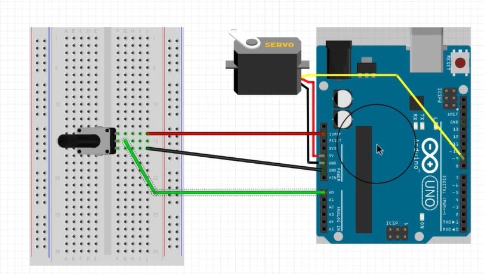

# 利用Arduino做一些有趣的事情

(English Version is down below)

## 制作呼吸灯

参考[这里](https://www.arduino.cn/thread-75674-1-1.html)的教程，我另外将LED灯数目增加，以营造出不一样的效果。

[这是我的源代码](LED-breathing-lamp.ino)

其中，绿色灯为LED1，接9号口；红色为LED2，接10号口；黄色为LED3，接11号口；红外线灯为LED4，接6号口；

请注意，一定要使用带波浪线的输出接口，否则无法营造出呼吸灯的效果。

[这是效果视频](LED-breathing-lamp.mp4)

---

这个视频中你可以看出，虽然我们人肉眼看不见红外线，但是相机却能拍出红外线，是不是很神奇呢！😀

## 用电位器控制电机角度

准备一个伺服电机和一个电位器，按如图所示接法连入电路：

[这是我的源代码](Controlling-motor-angle-with-potentiometer.ino)

[这是效果视频](Controlling-motor-angle-with-potentiometer.mp4)

# My experience of using Arduino to do some interesting things

## Make breathing LED

Refer to the tutorial [here] (https://www.arduino.cn/thread-75674-1-1.html), I increased the number of LED lights to create different effects.

[Here is my Source Code](LED-breathing-lamp.ino)

Among them, green light is LED1, connected to port 9; red light is LED2, connected to port 10; yellow light is LED3, connected to port 11; infrared light is LED4, connected to port 6;

Please note that you must only use port with wavy line, otherwise the effect of breathing LED cannot be created.

[Here is my showing video](LED-breathing-lamp.mp4)

---

In this video, you can see that although we can't see infrared radiation, but the camera can shoot infrared radiation, isn't it amazing? 😀

## Controlling motor angle with potentiometer

Prepare a servo motor and a potentiometer, and connect the circuit as shown in the figure:

[Here is my Source Code](Controlling-motor-angle-with-potentiometer.ino)

[Here is my showing video](LED-breathing-lamp.mp4)
